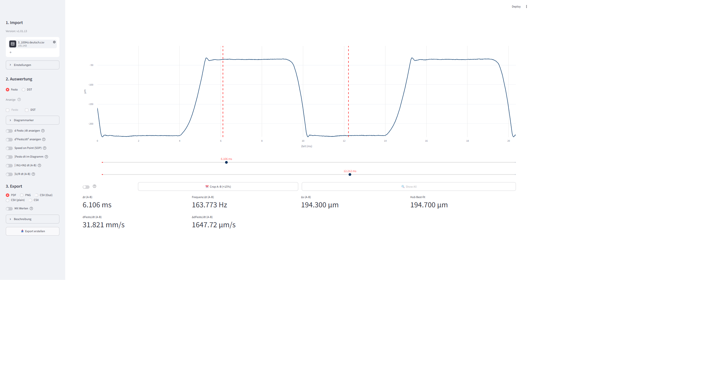
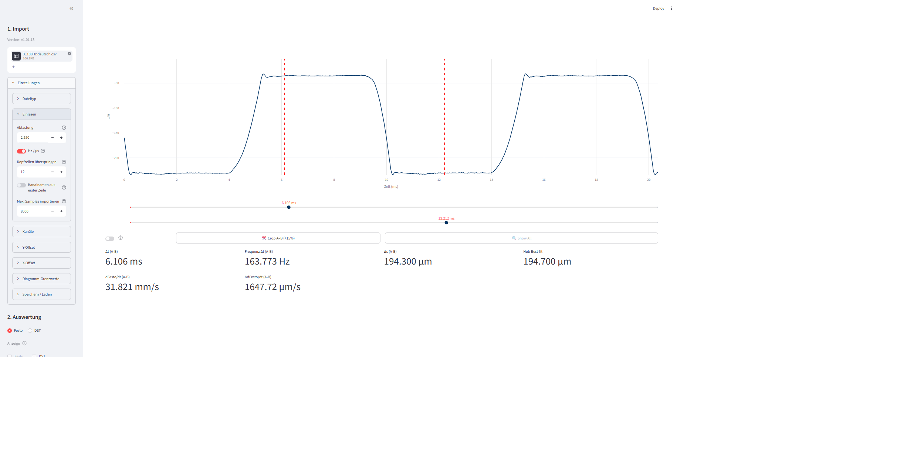
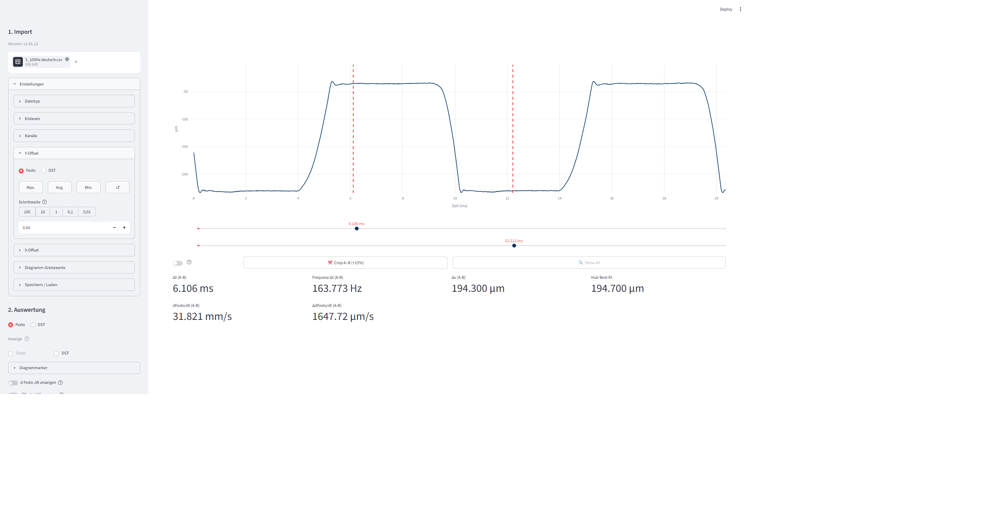
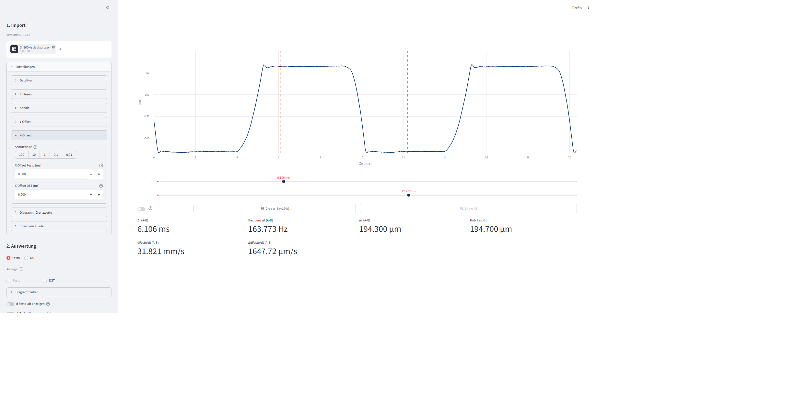
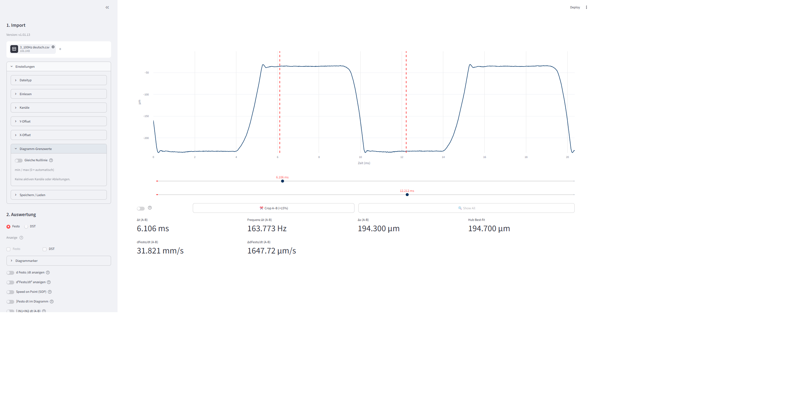
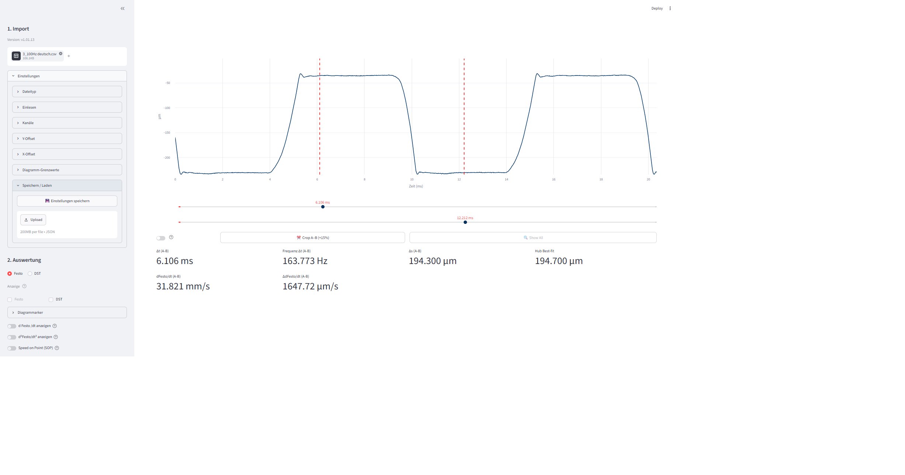
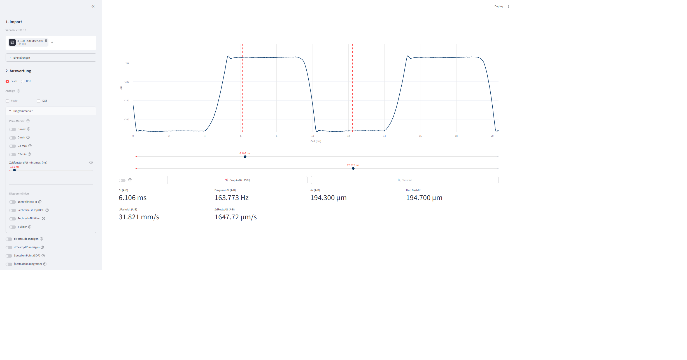
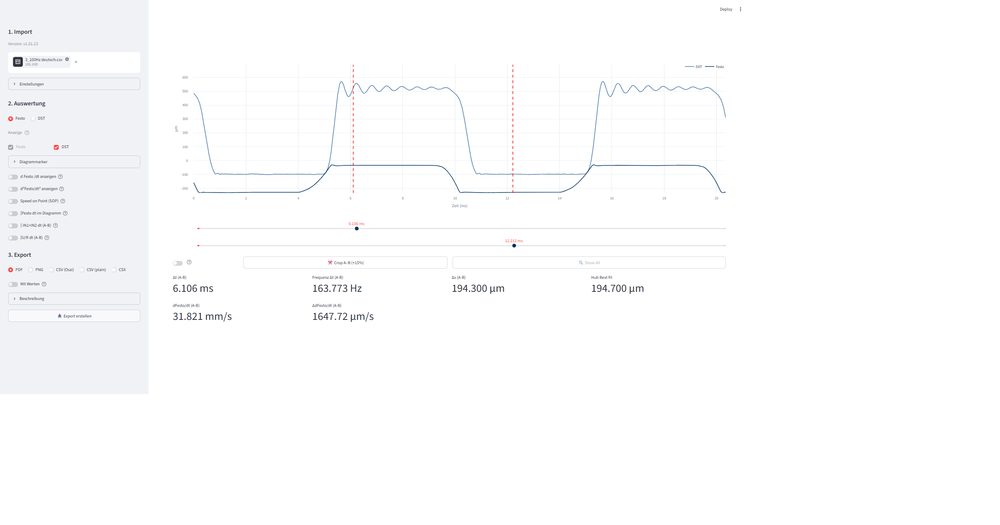
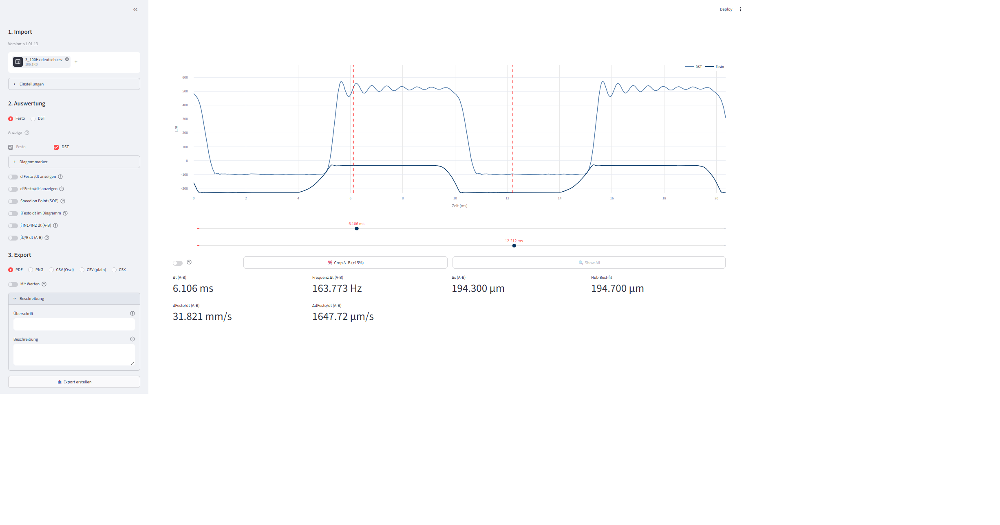

# Anleitung – VERMESSdaten Auswertung (Laservibrometer)

Web-Oberfläche zur Auswertung von CSV-Messdaten eines Laservibrometers. Zeigt Weg, Geschwindigkeit und Beschleunigung und exportiert Ergebnisse als PDF / PNG / CSV / CSX.

> **Version:** v1.05.00 · **Aufruf:** `streamlit run app.py` (Port 8501)

Die Sidebar ist in drei Abschnitte gegliedert: **1. Import**, **2. Auswertung**, **3. Export**. Jeder Einstell-Expander ist einzeln aufklappbar; in der Sidebar ist jeweils nur der gerade benötigte Bereich geöffnet, damit sie nicht zu lang wird.

---

## Übersicht

Nach dem Hochladen einer CSV-Datei erscheinen das interaktive Plotly-Diagramm (mit Weg- oder Geschwindigkeitskurve) und in der Sidebar die kompletten Einstellmöglichkeiten.

---

## 1. Import

### Datei-Upload & Dateityp

Unter **1. Import** wird eine CSV- oder CSX-Datei hochgeladen (Drag & Drop oder "Choose File"). Mit dem Radio **Dateityp** wird das Parser-Format eingestellt:

- **CSV plain** – Komma-getrennt, ohne Zeitachse
- **Hubmessung** – TAB-getrennt, mit Zeitachse (.txt)
- **Oszilloskop CSV** – Komma-getrennt, mit Zeitachse in Sekunden

### Einlesen

| Einstellung | Bedeutung |
|---|---|
| **Abtastung** | Abtastrate der Messung. Umschaltbar über „Hz / µs": Hz = Abtastfrequenz, µs = Zeitabstand pro Sample |
| **Kopfzeilen überspringen** | Anzahl der Zeilen am Dateianfang, die ignoriert werden (z. B. Metadaten-Header) |
| **Kanalnamen aus erster Zeile** | Übernimmt die erste Zeile der Datei als Kanalnamen |
| **Max. Samples importieren** | Maximale Anzahl Datenpunkte (0 = alle importieren) |

### Kanäle

Pro Kanal (max. `N_KANÄLE = 4`):

| Feld | Bedeutung |
|---|---|
| **Kanalname** | Name des Kanals; leer lassen, um den Kanal nicht einzulesen (automatisch „Kanal N") |
| **× (Skalierungsfaktor)** | Rohwert × Faktor; physikalische Skalierung |
| **Einheit** | Physikalische Einheit – bestimmt die Y-Achse (z. B. µm, mm/s) |
| **SG-Vorfilter** | Savitzky-Golay-Glättung vor allen Berechnungen (Polygrad 3); reduziert Digitalisierungsrauschen. Fenstergröße ungerade (3–99): größer = stärker geglättet |

Kanäle, die in der Datei nicht vorhanden sind, sind deaktiviert und mit *(nicht in Datei)* markiert.

### Y-Offset

Sorgt dafür, dass ein Kanal auf eine gewünschte Nulllinie verschoben wird.

| Element | Bedeutung |
|---|---|
| **Kanal-Auswahl (Radio)** | Für welchen Kanal der Offset gelten soll (Festo/DST) |
| **Max. / Avg. / Min.** | Schnell-Buttons: setzen den Y-Offset so, dass der Maximal- / Mittel- / Minimalwert im A–B-Bereich zu 0 wird |
| **↺** | Setzt alle Y-Offsets auf 0 zurück |
| **Schrittweite** | Schrittweite des Y-Offsets in Kanaleinheiten (z. B. µm, mm/s): 100 / 10 / 1 / 0,1 / 0,01 |
| **Spinbutton** | Aktueller Y-Offset-Wert (manuell einstellbar) |

### X-Offset

| Element | Bedeutung |
|---|---|
| **Schrittweite** | Schrittweite des X-Offsets in der gewählten Zeiteinheit |
| **X-Offset Festo (ms) / DST (ms)** | Zeitversatz pro Kanal – verschiebt den Kanal nach links (−) oder rechts (+). Wird genutzt, um mehrere Kanäle zeitlich zu synchronisieren |

### Diagramm-Grenzwerte

- **Gleiche Nulllinie** – Alle Kanäle auf „Automatik" werden so skaliert, dass die 0-Linie auf gleicher Höhe liegt
- **min / max (0 = automatisch)** – Pro Kanal/Ableitung lassen sich manuelle Y-Bereichsgrenzen eintragen; 0 bedeutet Plotly-Autoskalierung

> Im Screenshot erscheint „Keine aktiven Kanäle oder Ableitungen", weil die Grenzwerte erst nach Aktivierung einer Geschwindigkeits- oder Beschleunigungsableitung gefüllt werden.

### Speichern / Laden

| Element | Bedeutung |
|---|---|
| **💾 Einstellungen speichern** | Lädt alle aktuellen Einstellungen als JSON-Datei herunter |
| **Einstellungen laden (Upload)** | JSON-Datei mit gespeicherten Einstellungen hochladen – stellt den kompletten Sidebar-Zustand wieder her |

---

## 2. Auswertung

### Kanal-Auswahl & Anzeige

- **Kanal für Messung:** – aktiver Kanal (IN1) für alle Berechnungen: Cursor-Messung, d/dt-max, d²/dt²-max und SOP
- **Anzeige (Festo / DST)** – Kanäle ein-/ausblenden. Der aktive Mess-Kanal ist immer sichtbar

### Diagrammarker

**Peak-Marker** (Sichtbarkeit im Diagramm ein/aus):

| Toggle | Bedeutung |
|---|---|
| **D-max** | Linie des höchsten Geschwindigkeits-Peaks (betragsmäßig) |
| **D-min** | Linie des stärksten Abfalls (negativster Geschwindigkeitspeak) |
| **D2-max** | Marker des größten Beschleunigungs-Peaks (fallende Flanke) |
| **D2-min** | Marker des negativsten Beschleunigungs-Peaks (steigende Flanke) |

**Zeitfenster d/dt min./max. (ms)** – Slider: Mittelungsfenster für d/dt-max, d²/dt²-max und SOP. Der Peak wird über dieses Zeitfenster gemittelt. Klein = empfindlich, groß = robust gegenüber Rauschen.

**Diagrammlinien**:

| Toggle | Bedeutung |
|---|---|
| **Schnittlinie A–B** | Verbindungslinie von XA nach XB – zeigt die mittlere Änderungsrate dIN1/dt (A–B) |
| **Rechteck-Fit Top/Bot.** | Obere und untere gestrichelte Linie des Rechteck-Fits |
| **Rechteck-Fit füllen** | Vertikale Kantenlinien und hellgrüne Füllung für alle erkannten Rechteck-Pulse |
| **Y-Slider** | Zwei horizontale Hilfslinien (YA / YB), frei im Diagramm positionierbar |

### Toggles (Geschwindigkeit / Beschleunigung / Integrale)

| Toggle | Bedeutung |
|---|---|
| **d Festo/dt anzeigen** | Zeigt die 1. Ableitung (Geschwindigkeit) des aktiven Kanals auf einer 2. Y-Achse. Slider: Fenstergröße des SG-Filters (größer = glatter, aber geringere Detailauflösung) |
| **d²Festo/dt² anzeigen** | Zeigt die 2. Ableitung (Beschleunigung) auf einer 3. Y-Achse. Slider: Fenstergröße des SG-Filters (größere Werte nötig, da die 2. Ableitung stärker rauscht) |
| **Speed on Point (SOP)** | Zeigt die Geschwindigkeit an der steigenden Flanke des Rechtecksignals bei einem einstellbaren Hub. Slider: Höhe auf der steigenden Flanke in % (0 % = unterer Pegel, 100 % = oberer Pegel) |
| **∫Festo dt im Diagramm** | Zeichnet die Fläche unter dem aktiven Kanal zwischen XA und XB transparent ein (Integralbereich). Zusatz-Toggle: kumulativer Integralverlauf auf eigener Y-Achse, Startwert 0 bei XA |
| **∫ IN1×IN2 dt (A–B)** | Multipliziert zwei Kanäle und integriert das Produkt zwischen XA und XB (z. B. Strom × Spannung → VA·s) |
| **∫U/R dt (A–B)** | Integriert den berechneten Strom I = U/R zwischen XA und XB (Spannungskanal wählen, Widerstand in kΩ angeben; Standard 200 kΩ) |

### Cursor & Zeitachse (im Diagramm-Bereich)

Unter dem Diagramm befinden sich zwei Slider **XA** und **XB** – linker/rechter Cursor in der gewählten Zeiteinheit (ziehen oder Werte im Expander „Diagrammarker" eingeben).

- **Start @ 0** – Relative Zeitachse: linker Rand = 0. Slider und Anzeige in relativer Zeit
- **Crop auf A–B** – Schneidet die Ansicht auf den Bereich zwischen XA und XB zu (je 15 % Rand beiderseits); Reset zeigt wieder den gesamten Messzeitraum

---

## 3. Export

| Einstellung | Bedeutung |
|---|---|
| **Format** | PDF · PNG · CSV (Oszi) · CSV (plain) · CSX. PDF ist Standard |
| **Mit Werten** | Messwerte in PDF-Tabelle / PNG-Annotation einbetten |
| **Welche Messwerte?** | Auswahl, welche Messwerte exportiert werden |
| **Überschrift** | Titelzeile im PDF (max. 50 Zeichen; leer = automatisch aus Dateiname) |
| **Beschreibung** | Wird in kleinerer Schrift unter der Überschrift im PDF angezeigt (max. 200 Zeichen) |
| **Export-Button** | Erstellt die Exportdatei im gewählten Format – Download-Button erscheint danach |

---

---

## 4. Datei-Merger (separate Seite)

Die Seite **Datei-Merger** (Seitenleiste oben) kombiniert Kanäle aus mehreren Dateien gleichen Dateityps zu einer gemeinsamen Datei.

### Workflow

1. **Dateityp wählen** – CSV plain, Hubmessung oder Oszilloskop CSV (muss für alle Slots identisch sein)
2. **Bis zu 4 Dateien hochladen** – Pro Slot werden erkannte Kanäle, Sample-Anzahl und Zeitbasis (Δt / Hz) angezeigt
3. **Kanäle auswählen** – Gewünschte Kanäle per Checkbox auswählen (max. 4 insgesamt)
4. **Ausgabe-Kanalnamen anpassen** (optional)
5. **Sampleraten angleichen** (optional) – lineare Interpolation auf das kleinste Δt aller Kanäle
6. **Längenanpassung** – bei unterschiedlicher Sample-Anzahl: kürzen oder mit Füllwert auffüllen
7. **Exportformat wählen und herunterladen:**
   - **CSV plain** → Dateityp „CSV plain", Kopfzeilen = 0
   - **TXT (Hubmessung)** → Dateityp „Hubmessung", direkt importierbar
   - **Oszilloskop CSV** → Dateityp „Oszilloskop CSV", mit Einheiten-Zeile

---

## Tipps

- **Workflow:** Import → Kanäle prüfen → Y-/X-Offsets justieren → Geschwindigkeit/Beschleunigung aktivieren → Diagrammarker nach Bedarf → Export.
- **Synchronisation mehrerer Kanäle:** Mit **X-Offset** zeitlich ausrichten; mit **Gleiche Nulllinie** (Diagramm-Grenzwerte) auf gleiche Höhe bringen.
- **Rauschen reduzieren:** SG-Vorfilter pro Kanal oder größere Fenstergröße bei den Ableitungs-Toggles.
- **Wiederkehrende Messreihen:** Über **Speichern / Laden** die kompletten Einstellungen als JSON sichern.
- **Mehrere Einzelmessungen zusammenführen:** Datei-Merger → je 1 Kanal pro Datei → kombinierte Datei hochladen.
